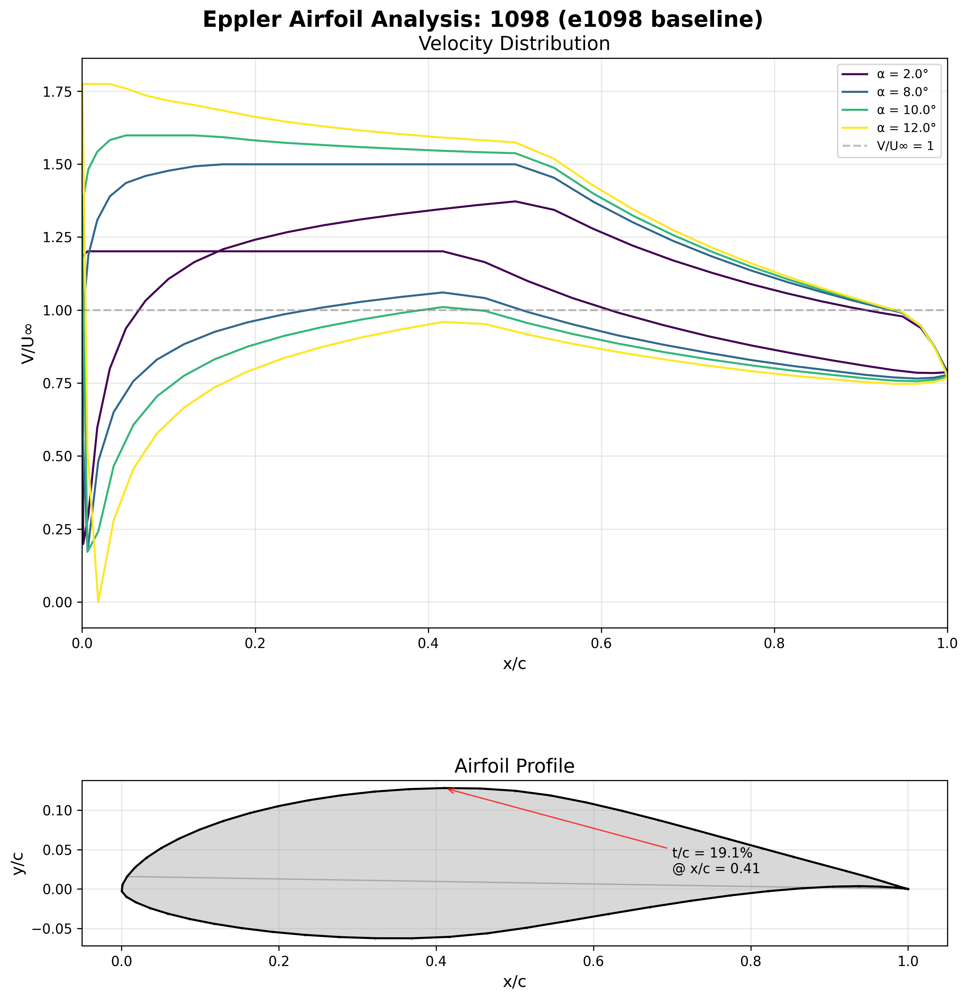
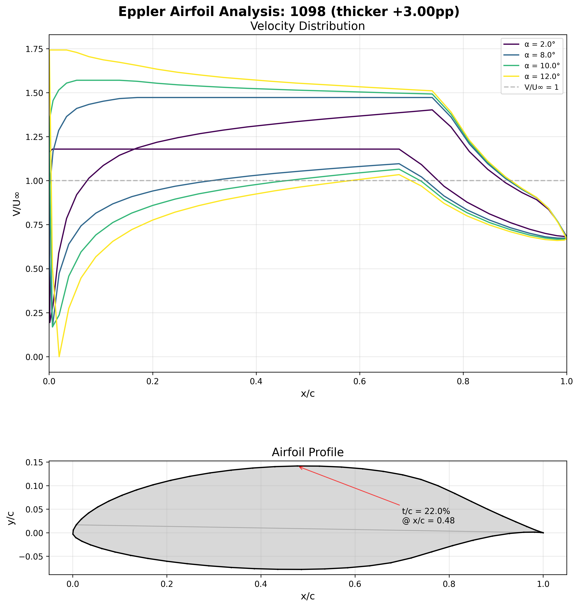
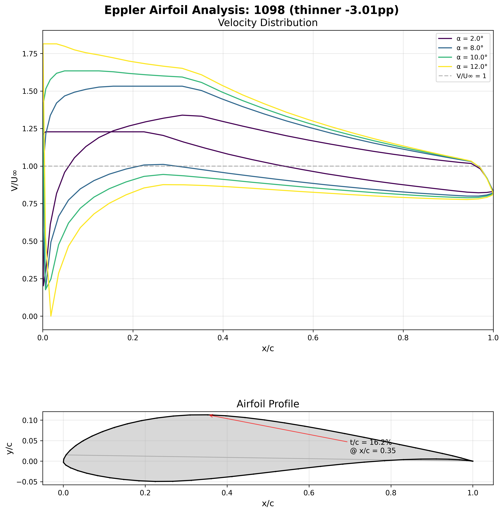
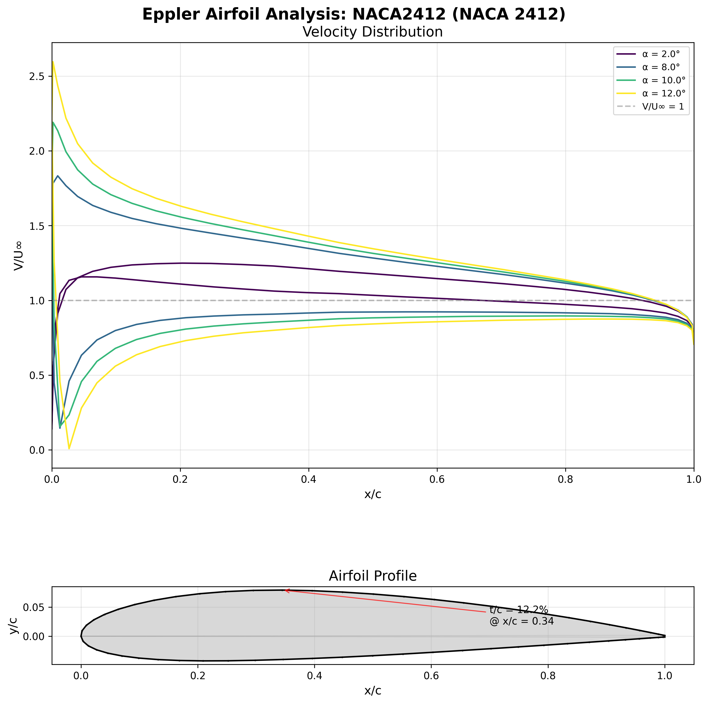
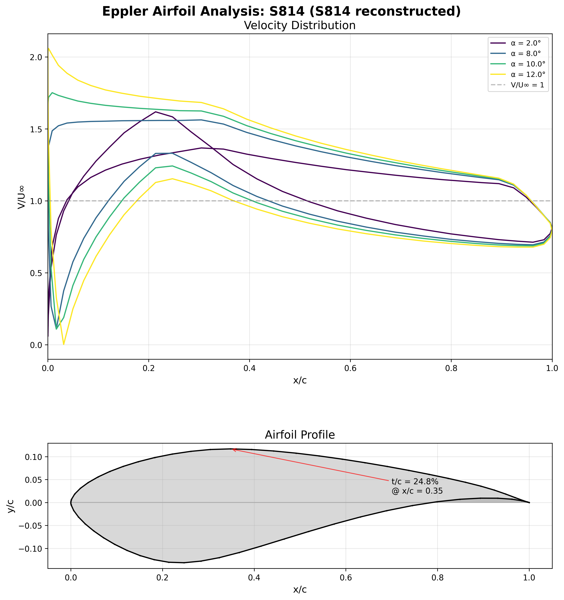
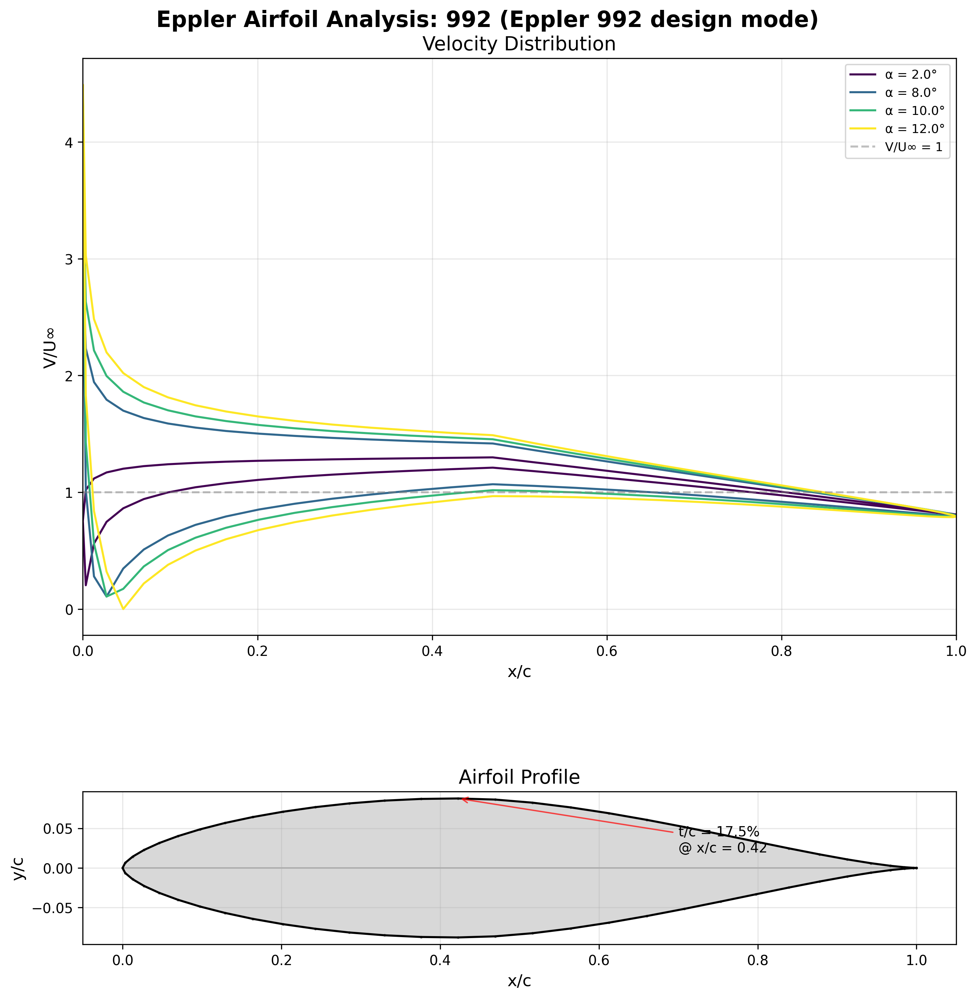

# Example: baseline + thicker + thinner E1098 decks

This document explains (1) how the fixed-format input decks are written/generated, (2) how `profile` processes them, and (3) how the PNG panels are produced from `profile.out`.

Repository locations after cleanup:

- Input decks: `data/input/*.dat`
- Solver outputs: `data/output/*`
- Plot script: `src/plot_data.py`
- Images: `assets/images/*.png`

## 1) Input deck format (fixed columns, Fortran internal READ)

`profile.f90` reads each record as `CHARACTER*80` and parses by column slices:

- **Cols 1-4**: command key (`TRA1`, `TRA2`, `ALFA`, `RE  `, `ENDE`, etc.).
- **Cols 5-10**: command flags (`I1/I3` style integer fields).
- **Cols 11-80**: usually `14F5.2` (14 fields, width 5, 2 decimals).

For `F5.2`, implied decimals are used when no decimal point is present:

- `1450` -> `14.50`
- `1305` -> `13.05`
- `1595` -> `15.95`
- `03` in a 5-char field -> `0.03`

Because parsing is fixed-column, spacing must preserve exact field boundaries.

## 2) How these two modifications were generated

We kept `TRA1`, `ALFA`, and `RE` identical and only changed **two `TRA2` `F5.2` fields** that were both `1450` in the baseline deck:

- **Thicker deck (`e1098a.dat`)**: `1450 -> 1851` (both occurrences), targeting `+3` percentage points thickness.
- **Thinner deck (`e1098b.dat`)**: `1450 -> 0956` (both occurrences), targeting `-3` percentage points thickness.

Those values are in `TRA2` fixed-width numeric payload (columns 11-80), so they are interpreted as `18.51` and `9.56`.

## 3) How the program processes these decks

Main flow for these examples:

1. `TRA1`: loads airfoil/transcendental setup arrays.
2. `TRA2`: reads 14 `F5.2` values into `puff`, stores `PURES(1:13)`, sets `IZZ`, runs `TRAPRO`.
3. `ALFA`: requests angle outputs and writes velocity table in `profile.out`.
4. `RE`: runs boundary-layer reporting.
5. `ENDE`: terminates processing.

The thickness line in `profile.out` (`AIRFOIL 1098 ... % THICKNESS`) reflects the modified solution for each deck.

Important: this project uses two different input modes:

- **Design-card mode** (`TRA1`/`TRA2`): used for `e1098.dat`, `e1098a.dat`, `e1098b.dat`, and `e1097.dat`.
- **Coordinate-analysis mode** (`FXPR`): used for `naca2412.dat`, where the geometry is supplied explicitly as `x,y` points.

## 4) How the images are plotted

`plot_data.py` does:

1. Parse `profile.out`:
   - find `AIRFOIL ... THICKNESS` line for ID,
   - find header line starting with `N X Y ...`,
   - read `x`, `y`, and velocity columns.
2. Plot a combined panel:
   - top: velocity distributions (`V/U∞`) vs `x/c`,
   - bottom: airfoil profile from `x,y`.
3. Save PNG output.

The three generated images included in this repo are:

## Baseline (`e1098.dat`)



## Thicker variant (`e1098a.dat`)



## Thinner variant (`e1098b.dat`)



## 5) Input decks reproduced exactly

### `e1098.dat` (baseline)

```text
TRA1  1098 2350  800 2750 1000  000 1200 6000  200
TRA2  1098  400 1450  200 1000  650  400 1450  200 1000  650  600  400  000  000
ALFA     4  200  800 1000 1200
RE  121   03    100003    3000
ENDE
```

### `e1098a.dat` (thicker)

```text
TRA1  1098 2350  800 2750 1000  000 1200 6000  200
TRA2  1098  400 1851  200 1000  650  400 1851  200 1000  650  600  400    0    0
ALFA     4  200  800 1000 1200
RE  121   03    100003    3000
ENDE
```

### `e1098b.dat` (thinner)

```text
TRA1  1098 2350  800 2750 1000  000 1200 6000  200
TRA2  1098  400  956  200 1000  650  400  956  200 1000  650  600  400    0    0
ALFA     4  200  800 1000 1200
RE  121   03    100003    3000
ENDE
```

## 6) Observed analysis summary

From `profile.out`:

| Deck | Thickness | ALPHA0 | CM0 | ETA |
|---|---:|---:|---:|---:|
| `e1098.dat` | 18.97% | 4.90 | -0.1237 | 1.137 |
| `e1098a.dat` (thicker) | 21.97% | 5.13 | -0.1311 | 1.171 |
| `e1098b.dat` (thinner) | 15.96% | 4.74 | -0.1190 | 1.116 |

This gives the expected directional behavior: the thicker case increases thickness/ETA and slightly shifts moment and zero-lift angle; the thinner case shifts in the opposite direction.

## 7) What `ALPHA0` means and why it matters

`ALPHA0` is the **zero-lift angle of attack** reported by the solver for the analyzed airfoil/setup.

- It is the aerodynamic reference angle where net lift is approximately zero in this model.
- It helps translate between geometric angle and aerodynamic loading when reading the velocity/pressure and polar outputs.
- It is useful for comparing variants, because shifts in `ALPHA0` indicate that the lift curve has moved relative to geometric angle.

## 8) Additional case: NACA 2412

To test a non-Eppler profile, a `naca2412.dat` case was generated using the program's `FXPR` path (explicit coordinate input), not `TRA1`/`TRA2` design cards.

### How `naca2412.dat` was generated

1. Compute NACA 2412 coordinates from the standard 4-digit definition:
   - camber `m=0.02`, camber position `p=0.4`, thickness `t=0.12`.
2. Build cosine-spaced points (`31` per surface).
3. Write an `FXPR` deck in the format expected by this code version:
   - `FXPR...` control line,
   - airfoil ID line (`NACA2412`),
   - `MUP MLOW`,
   - upper/lower `x,y` blocks in `8F10.5`,
   - `ALFA` line, then `ENDE`.

`RE` was intentionally omitted for this case, because adding it caused a floating-point exception in this executable for the NACA/FXPR path.

### NACA image



### `naca2412.dat` deck

```text
FXPR11001
NACA2412
   31   31
   0.00000   0.00147   0.00600   0.01353   0.02394   0.03707   0.05273   0.07070
   0.09073   0.11254   0.13582   0.16026   0.18552   0.21128   0.23720   0.26296
   0.28825   0.31275   0.33617   0.35823   0.37864   0.39715   0.41352   0.42752
   0.43891   0.44741   0.45276   0.45467   0.45288   0.44718   0.43744
   0.00000   0.00940   0.01871   0.02781   0.03657   0.04483   0.05240   0.05908
   0.06466   0.06895   0.07177   0.07296   0.07241   0.07005   0.06585   0.05983
   0.05205   0.04264   0.03177   0.01967   0.00662  -0.00710  -0.02116  -0.03518
  -0.04872  -0.06128  -0.07230  -0.08114  -0.08716  -0.08972  -0.08888
   0.00000   0.00949   0.02788   0.04525   0.06163   0.07708   0.09167   0.10551
   0.11871   0.13136   0.14351   0.15515   0.16628   0.17685   0.18680   0.19604
   0.20444   0.21189   0.21828   0.22353   0.22756   0.23031   0.23174   0.23180
   0.23049   0.22778   0.22369   0.21825   0.21149   0.20349   0.19435
   0.00000  -0.00524  -0.01059  -0.01600  -0.02139  -0.02667  -0.03174  -0.03650
  -0.04083  -0.04464  -0.04784  -0.05035  -0.05211  -0.05306  -0.05317  -0.05240
  -0.05075  -0.04823  -0.04486  -0.04068  -0.03578  -0.03026  -0.02424  -0.01786
  -0.01125  -0.00460   0.00189   0.00800   0.01346   0.01800   0.02126
ALFA     4  200  800 1000 1200
ENDE
```

### Comparison with `e1098.dat`

| Deck | Thickness | ALPHA0 | Notes |
|---|---:|---:|---|
| `e1098.dat` | 18.97% | 4.90 | Eppler design-card path (`TRA1/TRA2`) with boundary-layer `RE` card |
| `naca2412.dat` | 12.00% | 2.15 | Coordinate-input path (`FXPR`), thinner and lower zero-lift angle |

At the same listed angles (2/8/10/12 deg relative to zero-lift line), the NACA 2412 case shows lower peak `V/U∞` at 2 deg but higher peaks at 8-12 deg in this setup, with the largest difference at 12 deg.

### Real-aircraft usage examples for NACA 2412

From the aircraft/airfoil lookup list at UIUC/Lednicer, NACA 2412 appears on multiple aircraft, including:

- Cessna C-145 Airmaster
- Cessna C-165 Airmaster
- Cessna C-34
- Ikarus C42

Example photo (Ikarus C42, Wikimedia Commons):

[](https://commons.wikimedia.org/wiki/Category:Ikarus_C42)

Reference list:
https://m-selig.ae.illinois.edu/ads/aircraft.html

## 9) Reconstructed Somers S814 worked example (Eppler usage path)

The Somers report (`docs/Somers.pdf`) states that the **Eppler Code** was used for this work and cites **Eppler's Airfoil Program System (User's Guide, c.1991)**.  
It also references prior Eppler–Somers work, so this article is explicitly grounded in that Eppler software lineage, but it does not publish a full reproducible command deck.  
In the report, S814 is intended for the **root portion of a horizontal-axis wind-turbine blade**, specifically around the **0.40 blade radial station** (with companion S815 for the 0.30 station).
To fill that gap, this repo now includes a practical reconstruction that follows the same analysis route in this codebase:

1. Use published S814 geometry coordinates (from a public mirror of NREL S814 coordinates).
2. Convert them to this program's `FXPR` coordinate-input format (`8F10.5` blocks):
   - upper surface `x`/`y` from **LE -> TE**,
   - lower surface `x`/`y` from **LE -> TE**,
   - then `ALFA ...` and `ENDE`.
3. Run `bin/profile.exe` on `data/input/s814.dat`.
4. Plot `data/output/profile.out` with `src/plot_data.py`.

Generated artifacts:

- Deck: `data/input/s814.dat`
- Plot: `assets/images/s814.png`



Observed output highlights from this reconstruction:

- `AIRFOIL S814 24.02% THICKNESS`
- `ALPHA0 = 4.42 DEG`

Important limitation: this is a **reconstructed analysis workflow** (geometry-analysis mode, `FXPR`), not the original unpublished internal design-card sequence used by Somers during inverse design.

## 10) E864: experience report (free-input conversion vs `FXPR` fallback)

For airfoil **E864**, we tried the full "new book style" path first: take free-format `TRA1/TRA2` lines from Appendix III, convert to fixed-format cards, and run `bin/profile.exe`.

What happened:

1. The converted `TRA` path was **not robust** in this executable:
   - one variant ran into effectively non-terminating iteration output,
   - another variant produced a segmentation fault.
2. Because of this, no reliable `profile.out` was produced from the `TRA` route for plotting.

Fallback that worked:

1. Extract E864 coordinates from the book table (the same table listing E862/E863/E864).
2. Build an `FXPR` deck (`data/input/e864_fxpr.dat`) using upper/lower coordinate blocks (`8F10.5` style).
3. Run `bin/profile.exe` on that deck and plot with `src/plot_data.py`.

Generated artifacts:

- Attempted free/deck files: `data/input/known_bad/e864.free`, `data/input/known_bad/e864.dat` (quarantined; segfault/non-robust behavior in this executable)
- Working fallback deck: `data/input/e864_fxpr.dat`
- Output: `data/output/e864_fxpr.out`
- Plot: `assets/images/e864.png`

Observed result:

- Plot-derived thickness is about **38.83%**, close to the book's E864 designation (~38.9%).
- OCR cleanup was required when extracting numbers from the scanned PDF text.
- `FXPR` gave a practical, reproducible run in this repo even when the converted `TRA` path did not.

## 11) Clean design-mode example from the book: airfoil 992 (`TRA1`/`TRA2`)

To demonstrate a **working design-mode** (`TRA`) workflow from book-style input, we used the Chapter 3-style airfoil 992 example.

### Free-format deck (book-style)

File: `data/input/eppler992.free`

```text
TRAI 992 15 0 0 2.56 45 -2.56 60 0
TRA2 992 4 15 2 -.4 .645 4 15 2 -.4 .645 9 0 0
ALFA 4 2 8 10 12
ENDE
```

### Converted fixed-format deck (for this repo's parser)

File: `data/input/eppler992.dat`

```text
TRA1   992 1500    0    0  256 4500 -256 6000    0
TRA2   992  400 1500  200 -400  645  400 1500  200 -400  645  900    0    0
ALFA000  4  200  800 1000 1200
ENDE
```

### Run + output + plot

1. Convert free -> fixed using `src/free_to_fixed.py`.
2. Run `bin/profile.exe` with `data/input/eppler992.dat`.
3. Plot `data/output/eppler992.out` using `src/plot_data.py`.

Generated artifacts:

- Output: `data/output/eppler992.out`
- Plot: `assets/images/eppler992.png`

Observed highlights from `eppler992.out`:

- Trailing-edge iteration in **mode 9** converged (iterations 1-3 shown).
- `AIRFOIL 992 17.53% THICKNESS`
- `ALPHA0 = -0.00 DEG`


