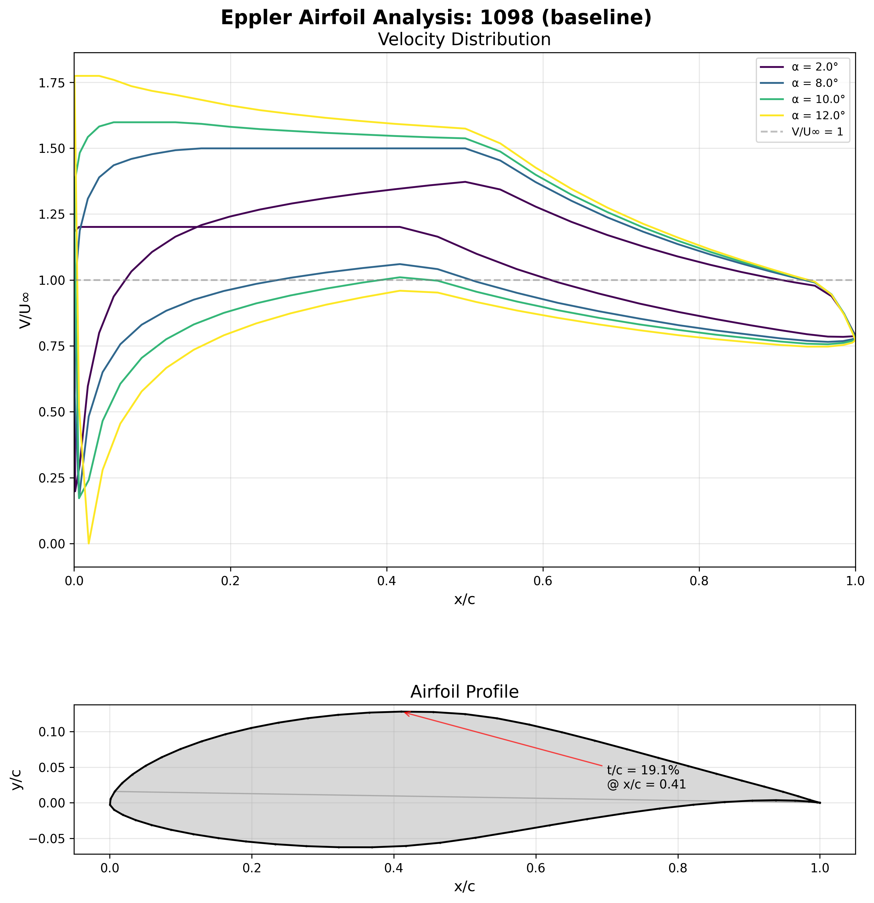
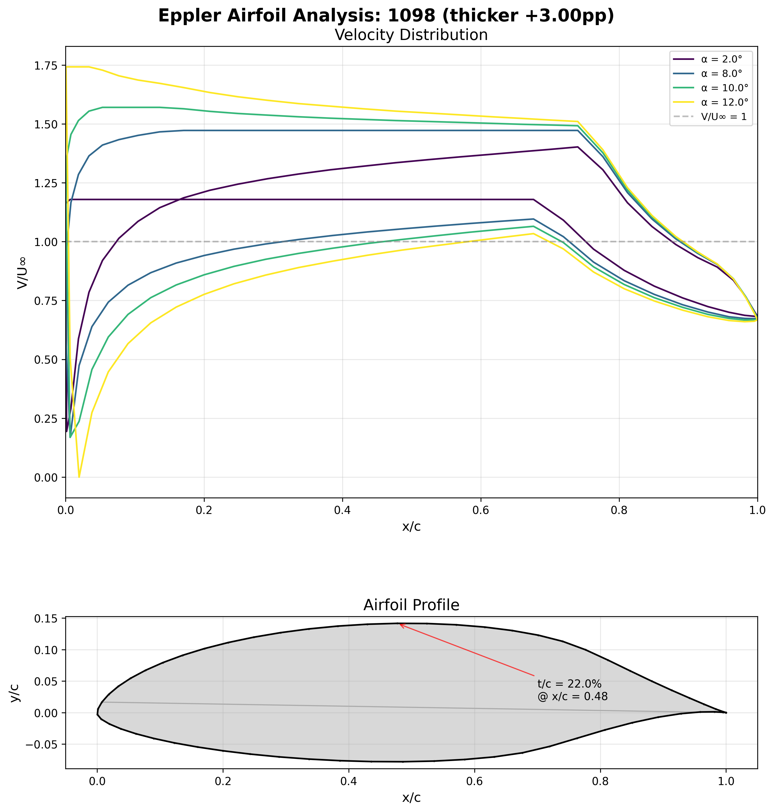
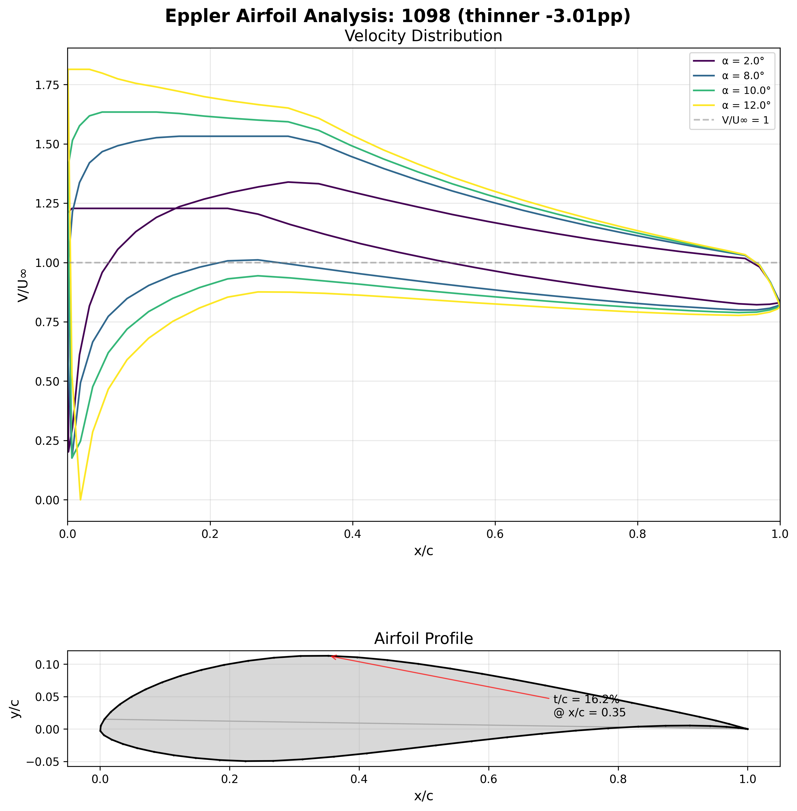

# Example: baseline + thicker + thinner E1098 decks

This document explains (1) how the fixed-format input decks are written/generated, (2) how `profile` processes them, and (3) how the PNG panels are produced from `profile.out`.

## 1) Input deck format (fixed columns, Fortran internal READ)

`profile.f90` reads each record as `CHARACTER*80` and parses by column slices:

- **Cols 1-4**: command key (`TRA1`, `TRA2`, `ALFA`, `RE  `, `ENDE`, etc.).
- **Cols 5-10**: command flags (`I1/I3` style integer fields).
- **Cols 11-80**: usually `14F5.2` (14 fields, width 5, 2 decimals).

For `F5.2`, implied decimals are used when no decimal point is present:

- `1450` -> `14.50`
- `1305` -> `13.05`
- `1595` -> `15.95`
- `03` in a 5-char field -> `0.03`

Because parsing is fixed-column, spacing must preserve exact field boundaries.

## 2) How these two modifications were generated

We kept `TRA1`, `ALFA`, and `RE` identical and only changed **two `TRA2` `F5.2` fields** that were both `1450` in the baseline deck:

- **Thicker deck (`e1098a.dat`)**: `1450 -> 1851` (both occurrences), targeting `+3` percentage points thickness.
- **Thinner deck (`e1098b.dat`)**: `1450 -> 0956` (both occurrences), targeting `-3` percentage points thickness.

Those values are in `TRA2` fixed-width numeric payload (columns 11-80), so they are interpreted as `18.51` and `9.56`.

## 3) How the program processes these decks

Main flow for these examples:

1. `TRA1`: loads airfoil/transcendental setup arrays.
2. `TRA2`: reads 14 `F5.2` values into `puff`, stores `PURES(1:13)`, sets `IZZ`, runs `TRAPRO`.
3. `ALFA`: requests angle outputs and writes velocity table in `profile.out`.
4. `RE`: runs boundary-layer reporting.
5. `ENDE`: terminates processing.

The thickness line in `profile.out` (`AIRFOIL 1098 ... % THICKNESS`) reflects the modified solution for each deck.

## 4) How the images are plotted

`plot_data.py` does:

1. Parse `profile.out`:
   - find `AIRFOIL ... THICKNESS` line for ID,
   - find header line starting with `N X Y ...`,
   - read `x`, `y`, and velocity columns.
2. Plot a combined panel:
   - top: velocity distributions (`V/U∞`) vs `x/c`,
   - bottom: airfoil profile from `x,y`.
3. Save PNG output.

The three generated images included in this repo are:

## Baseline (`e1098.dat`)



## Thicker variant (`e1098a.dat`)



## Thinner variant (`e1098b.dat`)



## 5) Input decks reproduced exactly

### `e1098.dat` (baseline)

```text
TRA1  1098 2350  800 2750 1000  000 1200 6000  200
TRA2  1098  400 1450  200 1000  650  400 1450  200 1000  650  600  400  000  000
ALFA     4  200  800 1000 1200
RE  121   03    100003    3000
ENDE
```

### `e1098a.dat` (thicker)

```text
TRA1  1098 2350  800 2750 1000  000 1200 6000  200
TRA2  1098  400 1851  200 1000  650  400 1851  200 1000  650  600  400    0    0
ALFA     4  200  800 1000 1200
RE  121   03    100003    3000
ENDE
```

### `e1098b.dat` (thinner)

```text
TRA1  1098 2350  800 2750 1000  000 1200 6000  200
TRA2  1098  400  956  200 1000  650  400  956  200 1000  650  600  400    0    0
ALFA     4  200  800 1000 1200
RE  121   03    100003    3000
ENDE
```

## 6) Observed analysis summary

From `profile.out`:

| Deck | Thickness | ALPHA0 | CM0 | ETA |
|---|---:|---:|---:|---:|
| `e1098.dat` | 18.97% | 4.90 | -0.1237 | 1.137 |
| `e1098a.dat` (thicker) | 21.97% | 5.13 | -0.1311 | 1.171 |
| `e1098b.dat` (thinner) | 15.96% | 4.74 | -0.1190 | 1.116 |

This gives the expected directional behavior: the thicker case increases thickness/ETA and slightly shifts moment and zero-lift angle; the thinner case shifts in the opposite direction.
